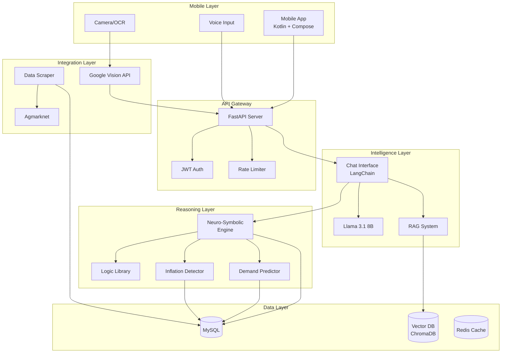

# Design Document: Kirana AI Advisor

## Overview

The Kirana AI Advisor is a comprehensive AI-powered management system that transforms traditional Indian Kirana stores into data-driven businesses. The system architecture combines mobile-first user experience with sophisticated backend AI capabilities, leveraging RAG (Retrieval-Augmented Generation), Neuro-Symbolic reasoning, and real-time market intelligence.

### Core Design Principles

1. **Proactive Intelligence**: Move beyond reactive reporting to predictive advisory
2. **Cultural Awareness**: Deep integration of Indian retail practices (Udhaar, festivals, Mandi systems)
3. **Hybrid AI**: Combine neural networks with symbolic business rules for explainable decisions
4. **Mobile-First**: Optimize for smartphone usage with offline capabilities
5. **Real-Time Processing**: Sub-5-second response times for critical operations
6. **Scalability**: Support thousands of stores with consistent performance

### System Architecture Layers

1. **Presentation Layer**: Mobile app (Kotlin/Jetpack Compose)
2. **API Gateway Layer**: FastAPI backend with authentication and rate limiting
3. **Intelligence Layer**: LangChain + Llama 3.1 LLM + RAG system
4. **Reasoning Layer**: Neuro-Symbolic engine with Logic Library
5. **Data Layer**: MySQL (transactional) + Vector DB (semantic search)
6. **Integration Layer**: External data scrapers and OCR services

## Architecture

### High-Level System Architecture




### Technology Stack

#### Mobile Frontend
- **Framework**: Kotlin with Jetpack Compose for declarative UI
- **Networking**: Retrofit + OkHttp for REST API communication
- **Camera**: CameraX for image capture with preview
- **Local Storage**: Room Database for offline data persistence
- **OCR**: Google ML Kit for on-device text recognition (fallback to Cloud Vision API)
- **State Management**: ViewModel + StateFlow for reactive UI updates
- **Dependency Injection**: Hilt for clean architecture

#### Backend & AI
- **API Framework**: FastAPI (Python) for high-performance async APIs
- **LLM**: Llama 3.1 8B fine-tuned on retail domain
- **Orchestration**: LangChain for RAG pipeline and agent workflows
- **Vector Database**: ChromaDB (development) / Pinecone (production) for embeddings
- **Embeddings**: sentence-transformers (multilingual models for Hindi/English)
- **Inference**: vLLM or TensorRT-LLM for optimized model serving

#### Data & Integration
- **Primary Database**: MySQL 8.0 for transactional data
- **Cache**: Redis for session management and frequent queries
- **Web Scraping**: BeautifulSoup + Selenium for dynamic content
- **Data Processing**: Pandas for ETL and analytics
- **OCR Service**: Google Cloud Vision API for complex handwriting
- **Scheduling**: Celery + Redis for background tasks (scraping, predictions)

#### Infrastructure
- **Cloud Provider**: AWS (primary) or GCP
- **Containerization**: Docker + Docker Compose
- **Orchestration**: Kubernetes (production) or ECS
- **API Gateway**: AWS API Gateway or Kong
- **Monitoring**: Prometheus + Grafana
- **Logging**: ELK Stack (Elasticsearch, Logstash, Kibana)
- **CI/CD**: GitHub Actions or GitLab CI

## Components and Interfaces

### 1. Mobile Application (Android)

#### Architecture Pattern
Clean Architecture with MVVM pattern:
- **Presentation Layer**: Composables + ViewModels
- **Domain Layer**: Use Cases + Repository Interfaces
- **Data Layer**: Repository Implementations + Data Sources (Remote API, Local DB)

#### Key Components

**MainActivity**
- Entry point managing navigation and app lifecycle
- Handles deep links and push notifications

**DashboardScreen**
- Displays daily sales summary, inventory alerts, top recommendations
- Real-time updates via WebSocket or polling
- Quick actions: Upload data, Start chat, View reports

**ChatScreen**
- Conversational interface with message history
- Voice input button with speech-to-text
- Language toggle (Hindi/English/Hinglish)
- Typing indicators and streaming responses

**DataUploadScreen**
- File picker for Excel uploads (.csv, .xlsx)
- Camera integration for Khatabook image capture
- Upload progress indicator
- Validation feedback and error display

**InventoryScreen**
- Product list with current stock levels
- Demand predictions with confidence intervals
- Restock alerts and recommendations
- Filter by category, low stock, slow-moving

**AnalyticsScreen**
- Interactive charts (sales trends, profit margins)
- Date range selector
- Export functionality (PDF, Excel)
- Drill-down capabilities

#### Data Models (Kotlin)

```kotlin
data class Transaction(
    val id: String,
    val date: LocalDateTime,
    val productId: String,
    val productName: String,
    val quantity: Double,
    val unitPrice: Double,
    val totalAmount: Double,
    val customerId: String?,
    val paymentType: PaymentType,
    val isUdhaar: Boolean
)

data class Product(
    val id: String,
    val name: String,
    val category: String,
    val currentStock: Double,
    val unit: String,
    val reorderLevel: Double,
    val lastRestockDate: LocalDateTime
)

data class DemandPrediction(
    val productId: String,
    val predictions: Map<Int, PredictionPoint>, // days -> prediction
    val confidence: Double,
    val factors: List<String>
)

data class PredictionPoint(
    val quantity: Double,
    val confidenceInterval: Pair<Double, Double>
)

data class ChatMessage(
    val id: String,
    val content: String,
    val isUser: Boolean,
    val timestamp: LocalDateTime,
    val language: Language
)

enum class PaymentType { CASH, UPI, CARD, UDHAAR }
enum class Language { HINDI, ENGLISH, HINGLISH }
```

#### API Client Interface

```kotlin
interface KiranaApiService {
    @POST("/api/v1/transactions/upload")
    suspend fun uploadTransactions(
        @Body transactions: List<Transaction>
    ): Response<UploadResult>
    
    @POST("/api/v1/ocr/process")
    suspend fun processImage(
        @Body image: MultipartBody.Part
    ): Response<OcrResult>
    
    @POST("/api/v1/chat")
    suspend fun sendChatMessage(
        @Body message: ChatRequest
    ): Response<ChatResponse>
    
    @GET("/api/v1/predictions/{productId}")
    suspend fun getDemandPrediction(
        @Path("productId") productId: String,
        @Query("days") days: Int
    ): Response<DemandPrediction>
    
    @GET("/api/v1/market/prices")
    suspend fun getMandiPrices(
        @Query("products") products: List<String>
    ): Response<MandiPrices>
    
    @GET("/api/v1/analytics/sales")
    suspend fun getSalesAnalytics(
        @Query("startDate") startDate: String,
        @Query("endDate") endDate: String
    ): Response<SalesAnalytics>
}
```

#### UI/UX Design Reference

The complete visual design and interactive prototype for the mobile application is available in Figma:

**Figma Prototype**: [User-friendly Kirana Store App](https://www.figma.com/make/KerffrZQ0ZC5Vy0Xv7W2vE/User-friendly-Kirana-Store-App?t=K3M2hHB1qdpCODup-1)

The Figma file includes:
- Complete screen designs for all mobile app features
- Interactive prototypes showing user flows
- Component library with reusable UI elements
- Design specifications (colors, typography, spacing)
- Responsive layouts for different screen sizes
- Accessibility considerations

**Key Screens Included**:
- Dashboard with sales summary and alerts
- Chat interface with multilingual support
- Data upload screens (Excel and camera)
- Inventory management with predictions
- Analytics and reporting views
- Settings and profile management

**Design System**:
- Color palette optimized for Indian users
- Typography supporting Hindi and English
- Icon set for retail operations
- Component states (default, active, disabled)
- Dark mode variants

Developers should reference the Figma prototype when implementing the mobile UI to ensure consistency with the approved design.

#### App Screenshots

**Dashboard Screen**

- Daily sales summary card
- Inventory alerts section
- Quick action buttons
- Bottom navigation bar
- Real-time metrics display

**AI Chat Interface**

- Conversational interface with message history
- User/AI message distinction
- Voice input button
- Language toggle (Hindi/English/Hinglish)
- Typing indicators and streaming responses
- Context-aware suggestions

**Inventory Management Screen**

- Product list with current stock levels
- Demand predictions with confidence intervals
- Restock alerts and recommendations
- Category filters and search
- Stock status indicators

**Inventory Details Screen**

- Detailed product information
- Historical sales trends
- Demand forecasting charts
- Reorder suggestions
- Stock movement tracking

**Tax and Alert Management**

- Tax calculation and GST compliance
- Critical alerts dashboard
- Price change notifications
- Supply shortage warnings
- Regulatory updates

**Udhaar (Credit) Management**

- Credit customer list
- Outstanding amounts tracking
- Payment history
- Credit limit management
- Collection reminders
- Aging analysis

*All screenshots are from the approved Figma prototype and represent the target UI/UX for implementation.*


### 2. Backend API Server (FastAPI)

#### API Structure

```python
# Main application structure
from fastapi import FastAPI, Depends, HTTPException, UploadFile
from fastapi.security import HTTPBearer
from pydantic import BaseModel
from typing import List, Optional, Dict
from datetime import datetime

app = FastAPI(title="Kirana AI Advisor API", version="1.0.0")
security = HTTPBearer()

# Request/Response Models
class TransactionCreate(BaseModel):
    date: datetime
    product_id: str
    product_name: str
    quantity: float
    unit_price: float
    total_amount: float
    customer_id: Optional[str]
    payment_type: str
    is_udhaar: bool

class ChatRequest(BaseModel):
    message: str
    language: str
    conversation_id: Optional[str]
    
class ChatResponse(BaseModel):
    response: str
    language: str
    conversation_id: str
    sources: List[str]
    confidence: float

class DemandPredictionResponse(BaseModel):
    product_id: str
    predictions: Dict[int, Dict[str, float]]
    confidence: float
    factors: List[str]
    
class MandiPrice(BaseModel):
    product: str
    mandi_name: str
    price: float
    unit: str
    date: datetime
    change_percent: float

# API Endpoints
@app.post("/api/v1/transactions/upload")
async def upload_transactions(
    transactions: List[TransactionCreate],
    user_id: str = Depends(get_current_user)
):
    """Bulk upload transactions from Excel or manual entry"""
    pass

@app.post("/api/v1/ocr/process")
async def process_ocr(
    file: UploadFile,
    user_id: str = Depends(get_current_user)
):
    """Process Khatabook image and extract transactions"""
    pass

@app.post("/api/v1/chat")
async def chat(
    request: ChatRequest,
    user_id: str = Depends(get_current_user)
):
    """Handle conversational queries with RAG"""
    pass

@app.get("/api/v1/predictions/{product_id}")
async def get_demand_prediction(
    product_id: str,
    days: int = 30,
    user_id: str = Depends(get_current_user)
):
    """Get demand predictions for a product"""
    pass

@app.get("/api/v1/market/prices")
async def get_mandi_prices(
    products: List[str],
    user_id: str = Depends(get_current_user)
):
    """Get current Mandi prices for products"""
    pass
```

#### Service Layer Architecture

```python
# services/data_ingestion.py
class DataIngestionService:
    def __init__(self, db: Database, validator: DataValidator):
        self.db = db
        self.validator = validator
    
    async def process_excel(self, file: UploadFile, user_id: str) -> UploadResult:
        """Parse Excel file and validate transactions"""
        df = pd.read_excel(file.file)
        transactions = self._parse_dataframe(df)
        validated = self.validator.validate_batch(transactions)
        await self.db.insert_transactions(validated, user_id)
        return UploadResult(success=True, count=len(validated))
    
    async def process_ocr_image(self, image: bytes, user_id: str) -> OcrResult:
        """Extract text from image and parse transactions"""
        text = await self.ocr_engine.extract_text(image)
        transactions = self._parse_khatabook_text(text)
        return OcrResult(transactions=transactions, confidence=0.85)

# services/chat_service.py
class ChatService:
    def __init__(self, rag_system: RAGSystem, llm: LLM):
        self.rag = rag_system
        self.llm = llm
    
    async def process_query(self, query: str, user_id: str, language: str) -> ChatResponse:
        """Process user query with RAG and LLM"""
        # Retrieve relevant context
        context = await self.rag.retrieve(query, user_id, top_k=5)
        
        # Generate response with LLM
        prompt = self._build_prompt(query, context, language)
        response = await self.llm.generate(prompt)
        
        return ChatResponse(
            response=response.text,
            language=language,
            sources=context.sources,
            confidence=response.confidence
        )

# services/prediction_service.py
class PredictionService:
    def __init__(self, demand_predictor: DemandPredictor, db: Database):
        self.predictor = demand_predictor
        self.db = db
    
    async def predict_demand(
        self, 
        product_id: str, 
        user_id: str, 
        days: int
    ) -> DemandPrediction:
        """Generate demand predictions using ML model"""
        # Fetch historical data
        history = await self.db.get_product_history(product_id, user_id)
        
        # Get contextual factors
        festivals = await self.db.get_upcoming_festivals(days)
        market_trends = await self.db.get_market_trends(product_id)
        
        # Run prediction
        prediction = self.predictor.predict(
            history=history,
            festivals=festivals,
            market_trends=market_trends,
            horizon=days
        )
        
        return prediction
```


### 3. RAG System (Retrieval-Augmented Generation)

#### Architecture

The RAG system combines semantic search over vectorized data with LLM generation to provide grounded, context-aware responses.

#### Components

**Embedding Pipeline**
```python
class EmbeddingPipeline:
    def __init__(self, model_name: str = "sentence-transformers/paraphrase-multilingual-mpnet-base-v2"):
        self.model = SentenceTransformer(model_name)
        self.vector_db = ChromaDB()
    
    async def embed_transaction(self, transaction: Transaction, user_id: str):
        """Create embedding for transaction and store in vector DB"""
        text = self._transaction_to_text(transaction)
        embedding = self.model.encode(text)
        
        await self.vector_db.add(
            embedding=embedding,
            metadata={
                "user_id": user_id,
                "type": "transaction",
                "date": transaction.date,
                "product": transaction.product_name,
                "amount": transaction.total_amount
            },
            document=text
        )
    
    async def embed_market_data(self, mandi_price: MandiPrice):
        """Create embedding for market intelligence"""
        text = f"{mandi_price.product} price at {mandi_price.mandi_name}: ₹{mandi_price.price}/{mandi_price.unit}"
        embedding = self.model.encode(text)
        
        await self.vector_db.add(
            embedding=embedding,
            metadata={
                "type": "market_data",
                "product": mandi_price.product,
                "date": mandi_price.date
            },
            document=text
        )
```

**Retrieval System**
```python
class RAGRetriever:
    def __init__(self, vector_db: ChromaDB, embedding_model: SentenceTransformer):
        self.vector_db = vector_db
        self.embedding_model = embedding_model
    
    async def retrieve(
        self, 
        query: str, 
        user_id: str, 
        top_k: int = 5,
        filters: Optional[Dict] = None
    ) -> RetrievalResult:
        """Retrieve relevant documents for query"""
        # Embed query
        query_embedding = self.embedding_model.encode(query)
        
        # Build filters
        filter_dict = {"user_id": user_id}
        if filters:
            filter_dict.update(filters)
        
        # Search vector DB
        results = await self.vector_db.query(
            query_embedding=query_embedding,
            n_results=top_k,
            where=filter_dict
        )
        
        return RetrievalResult(
            documents=results["documents"],
            metadata=results["metadatas"],
            distances=results["distances"]
        )
```

**RAG Chain**
```python
class RAGChain:
    def __init__(self, retriever: RAGRetriever, llm: LLM):
        self.retriever = retriever
        self.llm = llm
    
    async def query(self, question: str, user_id: str, language: str) -> str:
        """Execute RAG pipeline: retrieve + generate"""
        # Retrieve relevant context
        context = await self.retriever.retrieve(question, user_id, top_k=5)
        
        # Build prompt with context
        prompt = self._build_rag_prompt(question, context, language)
        
        # Generate response
        response = await self.llm.generate(prompt, max_tokens=500)
        
        # Verify grounding (check if response uses context)
        if not self._is_grounded(response, context):
            return "I don't have enough information to answer that question accurately."
        
        return response
    
    def _build_rag_prompt(self, question: str, context: RetrievalResult, language: str) -> str:
        """Build prompt with retrieved context"""
        context_text = "\n".join([
            f"- {doc}" for doc in context.documents
        ])
        
        if language == "hindi":
            system_msg = "आप एक किराना स्टोर सलाहकार हैं।"
        else:
            system_msg = "You are a Kirana store advisor."
        
        prompt = f"""{system_msg}

Context from store data:
{context_text}

Question: {question}

Provide a helpful answer based on the context above. If the context doesn't contain relevant information, say so."""
        
        return prompt
```

### 4. Neuro-Symbolic Reasoning Engine

The Neuro-Symbolic Engine combines neural network predictions with symbolic business rules to provide explainable, culturally-aware recommendations.

#### Architecture

```python
class NeuroSymbolicEngine:
    def __init__(
        self, 
        neural_predictor: DemandPredictor,
        logic_library: LogicLibrary,
        conflict_resolver: ConflictResolver
    ):
        self.neural = neural_predictor
        self.logic = logic_library
        self.resolver = conflict_resolver
    
    async def recommend_restock(
        self, 
        product_id: str, 
        user_id: str
    ) -> RestockRecommendation:
        """Combine neural prediction with symbolic rules"""
        # Neural prediction
        neural_demand = await self.neural.predict(product_id, user_id, days=14)
        
        # Symbolic rules
        symbolic_constraints = self.logic.get_restock_rules(product_id)
        
        # Check for conflicts
        if self._has_conflict(neural_demand, symbolic_constraints):
            resolved = self.resolver.resolve(neural_demand, symbolic_constraints)
            self._log_conflict(product_id, neural_demand, symbolic_constraints, resolved)
            return resolved
        
        # Combine recommendations
        return self._merge_recommendations(neural_demand, symbolic_constraints)
```

#### Logic Library

```python
class LogicLibrary:
    """Encodes Indian retail business rules"""
    
    def __init__(self):
        self.rules = self._load_rules()
        self.festival_calendar = FestivalCalendar()
    
    def get_udhaar_credit_limit(self, customer_id: str, history: List[Transaction]) -> float:
        """Calculate credit limit using rule-based logic"""
        # Rule 1: Base limit on payment history
        payment_rate = self._calculate_payment_rate(history)
        base_limit = 5000 if payment_rate > 0.9 else 2000
        
        # Rule 2: Adjust for customer tenure
        tenure_months = self._calculate_tenure(history)
        if tenure_months > 12:
            base_limit *= 1.5
        
        # Rule 3: Cap at 3x average monthly purchase
        avg_monthly = self._average_monthly_purchase(history)
        max_limit = avg_monthly * 3
        
        return min(base_limit, max_limit)
    
    def get_festival_demand_multiplier(self, product_category: str, days_to_festival: int) -> float:
        """Get demand multiplier based on upcoming festivals"""
        upcoming = self.festival_calendar.get_upcoming(days=days_to_festival)
        
        multipliers = []
        for festival in upcoming:
            if product_category in festival.relevant_categories:
                # Closer festivals have higher impact
                time_factor = 1.0 - (days_to_festival / 30)
                multipliers.append(festival.demand_multiplier * time_factor)
        
        return max(multipliers) if multipliers else 1.0
    
    def should_exclude_outlier(self, transaction: Transaction, history: List[Transaction]) -> bool:
        """Determine if transaction is an outlier (wedding, bulk order)"""
        avg_quantity = np.mean([t.quantity for t in history])
        std_quantity = np.std([t.quantity for t in history])
        
        # Rule: Exclude if > 3 standard deviations from mean
        if transaction.quantity > avg_quantity + (3 * std_quantity):
            return True
        
        # Rule: Exclude if single transaction > 20% of monthly volume
        monthly_volume = sum(t.quantity for t in history[-30:])
        if transaction.quantity > 0.2 * monthly_volume:
            return True
        
        return False
```

#### Festival Calendar

```python
class FestivalCalendar:
    """Manages Indian festival dates and regional variations"""
    
    def __init__(self):
        self.festivals = self._load_festivals()
        self.regional_variations = self._load_regional_data()
    
    def get_upcoming(self, days: int, region: Optional[str] = None) -> List[Festival]:
        """Get festivals in next N days"""
        today = datetime.now()
        cutoff = today + timedelta(days=days)
        
        upcoming = [
            f for f in self.festivals 
            if today <= f.date <= cutoff
        ]
        
        if region:
            upcoming = [f for f in upcoming if region in f.regions]
        
        return upcoming
    
    def _load_festivals(self) -> List[Festival]:
        """Load festival data with product categories"""
        return [
            Festival(
                name="Diwali",
                date=datetime(2024, 11, 1),
                regions=["North", "West", "Central"],
                relevant_categories=["sweets", "dry_fruits", "oil", "decorations"],
                demand_multiplier=2.5
            ),
            Festival(
                name="Holi",
                date=datetime(2024, 3, 25),
                regions=["North"],
                relevant_categories=["colors", "sweets", "snacks"],
                demand_multiplier=2.0
            ),
            Festival(
                name="Eid",
                date=datetime(2024, 4, 11),
                regions=["All"],
                relevant_categories=["meat", "dates", "sweets", "vermicelli"],
                demand_multiplier=2.2
            ),
            Festival(
                name="Pongal",
                date=datetime(2024, 1, 15),
                regions=["South"],
                relevant_categories=["rice", "jaggery", "turmeric", "sugarcane"],
                demand_multiplier=2.0
            ),
            Festival(
                name="Onam",
                date=datetime(2024, 9, 15),
                regions=["Kerala"],
                relevant_categories=["vegetables", "coconut", "banana", "rice"],
                demand_multiplier=1.8
            )
        ]
```


### 5. Demand Prediction System

#### ML Model Architecture

```python
class DemandPredictor:
    """Time series forecasting with contextual features"""
    
    def __init__(self):
        self.model = self._build_model()
        self.feature_engineer = FeatureEngineer()
    
    def _build_model(self):
        """Build ensemble model: LSTM + XGBoost"""
        # LSTM for temporal patterns
        lstm_model = Sequential([
            LSTM(128, return_sequences=True, input_shape=(30, 10)),
            Dropout(0.2),
            LSTM(64),
            Dense(32, activation='relu'),
            Dense(1)
        ])
        
        # XGBoost for feature-based prediction
        xgb_model = XGBRegressor(
            n_estimators=100,
            max_depth=6,
            learning_rate=0.1
        )
        
        return EnsembleModel(lstm=lstm_model, xgb=xgb_model)
    
    async def predict(
        self, 
        product_id: str, 
        user_id: str, 
        days: int
    ) -> DemandPrediction:
        """Generate demand forecast"""
        # Fetch historical data
        history = await self._get_history(product_id, user_id, days=90)
        
        # Engineer features
        features = self.feature_engineer.create_features(
            history=history,
            product_id=product_id,
            forecast_days=days
        )
        
        # Generate predictions
        predictions = self.model.predict(features)
        
        # Calculate confidence intervals
        confidence_intervals = self._calculate_confidence(predictions, history)
        
        # Identify contributing factors
        factors = self._explain_prediction(features, predictions)
        
        return DemandPrediction(
            product_id=product_id,
            predictions=predictions,
            confidence_intervals=confidence_intervals,
            factors=factors
        )

class FeatureEngineer:
    """Create features for demand prediction"""
    
    def create_features(
        self, 
        history: List[Transaction], 
        product_id: str,
        forecast_days: int
    ) -> pd.DataFrame:
        """Engineer temporal and contextual features"""
        df = pd.DataFrame(history)
        
        # Temporal features
        df['day_of_week'] = df['date'].dt.dayofweek
        df['day_of_month'] = df['date'].dt.day
        df['month'] = df['date'].dt.month
        df['is_weekend'] = df['day_of_week'].isin([5, 6])
        
        # Lag features
        df['lag_7'] = df['quantity'].shift(7)
        df['lag_14'] = df['quantity'].shift(14)
        df['lag_30'] = df['quantity'].shift(30)
        
        # Rolling statistics
        df['rolling_mean_7'] = df['quantity'].rolling(7).mean()
        df['rolling_std_7'] = df['quantity'].rolling(7).std()
        df['rolling_mean_30'] = df['quantity'].rolling(30).mean()
        
        # Trend features
        df['trend'] = self._calculate_trend(df['quantity'])
        
        # Festival features
        df['days_to_festival'] = self._days_to_next_festival(df['date'])
        df['festival_multiplier'] = self._get_festival_multiplier(df['date'], product_id)
        
        # Market features
        df['mandi_price'] = self._get_mandi_price(df['date'], product_id)
        df['price_change'] = df['mandi_price'].pct_change()
        
        return df
```

#### Outlier Detection

```python
class OutlierHandler:
    """Detect and handle exceptional events"""
    
    def __init__(self, threshold_std: float = 3.0):
        self.threshold_std = threshold_std
    
    def detect_outliers(self, transactions: List[Transaction]) -> List[bool]:
        """Identify outlier transactions"""
        quantities = [t.quantity for t in transactions]
        mean = np.mean(quantities)
        std = np.std(quantities)
        
        outliers = []
        for t in transactions:
            z_score = abs((t.quantity - mean) / std)
            is_outlier = z_score > self.threshold_std
            outliers.append(is_outlier)
        
        return outliers
    
    def filter_for_baseline(self, transactions: List[Transaction]) -> List[Transaction]:
        """Remove outliers for baseline demand calculation"""
        outliers = self.detect_outliers(transactions)
        return [t for t, is_outlier in zip(transactions, outliers) if not is_outlier]
    
    def classify_outlier_type(self, transaction: Transaction, context: Dict) -> str:
        """Classify outlier as wedding, bulk order, or other"""
        if transaction.quantity > context['monthly_avg'] * 0.5:
            if transaction.customer_id and context['customer_type'] == 'business':
                return "bulk_order"
            else:
                return "wedding_event"
        return "unknown"
```

### 6. Market Intelligence and Data Scraping

#### Web Scraper

```python
class AgmarknetScraper:
    """Scrape Mandi prices from government portal"""
    
    def __init__(self):
        self.base_url = "https://agmarknet.gov.in"
        self.session = requests.Session()
    
    async def scrape_daily_prices(self, date: datetime) -> List[MandiPrice]:
        """Scrape prices for all tracked products"""
        prices = []
        
        for product in self.tracked_products:
            try:
                html = await self._fetch_page(product, date)
                parsed = self._parse_price_table(html)
                prices.extend(parsed)
            except Exception as e:
                logger.error(f"Failed to scrape {product}: {e}")
                continue
        
        return prices
    
    def _parse_price_table(self, html: str) -> List[MandiPrice]:
        """Parse HTML table to extract prices"""
        soup = BeautifulSoup(html, 'html.parser')
        table = soup.find('table', {'class': 'tableagmark'})
        
        prices = []
        for row in table.find_all('tr')[1:]:  # Skip header
            cols = row.find_all('td')
            if len(cols) >= 5:
                prices.append(MandiPrice(
                    product=cols[0].text.strip(),
                    mandi_name=cols[1].text.strip(),
                    price=float(cols[3].text.strip()),
                    unit=cols[4].text.strip(),
                    date=datetime.now()
                ))
        
        return prices

class InflationDetector:
    """Monitor supply-demand dynamics and price changes"""
    
    def __init__(self, db: Database):
        self.db = db
        self.alert_threshold = 0.15  # 15% change
    
    async def detect_inflation(self, product: str) -> Optional[InflationAlert]:
        """Detect significant price changes"""
        # Get recent price history
        prices = await self.db.get_price_history(product, days=30)
        
        if len(prices) < 2:
            return None
        
        # Calculate price velocity
        current_price = prices[-1].price
        week_ago_price = prices[-7].price if len(prices) >= 7 else prices[0].price
        
        change_percent = (current_price - week_ago_price) / week_ago_price
        
        if abs(change_percent) > self.alert_threshold:
            # Analyze supply-demand indicators
            volume_trend = self._analyze_volume_trend(prices)
            
            return InflationAlert(
                product=product,
                price_change=change_percent,
                current_price=current_price,
                volume_trend=volume_trend,
                severity="high" if abs(change_percent) > 0.25 else "medium",
                recommendation=self._generate_recommendation(change_percent, volume_trend)
            )
        
        return None
    
    def _generate_recommendation(self, price_change: float, volume_trend: str) -> str:
        """Generate actionable recommendation"""
        if price_change > 0.15 and volume_trend == "decreasing":
            return "Supply shortage detected. Consider stocking up now or finding alternative suppliers."
        elif price_change < -0.15 and volume_trend == "increasing":
            return "Prices dropping due to oversupply. Good time to stock up for future demand."
        else:
            return "Monitor prices closely for next few days."
```


### 7. OCR and Image Processing

#### OCR Pipeline

```python
class OCREngine:
    """Extract text from Khatabook images"""
    
    def __init__(self):
        self.google_vision = vision.ImageAnnotatorClient()
        self.ml_kit_fallback = MLKitOCR()
    
    async def extract_text(self, image_bytes: bytes, language: str = "hi") -> OCRResult:
        """Extract text using Google Cloud Vision API"""
        try:
            image = vision.Image(content=image_bytes)
            
            # Configure for Hindi/English
            image_context = vision.ImageContext(
                language_hints=["hi", "en"]
            )
            
            response = self.google_vision.document_text_detection(
                image=image,
                image_context=image_context
            )
            
            if response.error.message:
                raise Exception(response.error.message)
            
            # Extract full text and structured data
            full_text = response.full_text_annotation.text
            confidence = self._calculate_confidence(response)
            
            return OCRResult(
                text=full_text,
                confidence=confidence,
                language=self._detect_language(full_text)
            )
            
        except Exception as e:
            logger.warning(f"Google Vision failed: {e}, falling back to ML Kit")
            return await self.ml_kit_fallback.extract_text(image_bytes)
    
    def _calculate_confidence(self, response) -> float:
        """Calculate average confidence from OCR response"""
        confidences = []
        for page in response.full_text_annotation.pages:
            for block in page.blocks:
                confidences.append(block.confidence)
        return np.mean(confidences) if confidences else 0.0

class KhatabookParser:
    """Parse extracted text into structured transactions"""
    
    def __init__(self):
        self.patterns = self._compile_patterns()
    
    def parse(self, text: str) -> List[Transaction]:
        """Parse Khatabook text into transactions"""
        lines = text.split('\n')
        transactions = []
        
        for line in lines:
            # Try to match transaction pattern
            match = self._match_transaction(line)
            if match:
                transactions.append(self._create_transaction(match))
        
        return transactions
    
    def _match_transaction(self, line: str) -> Optional[Dict]:
        """Match line against transaction patterns"""
        # Pattern: Date | Product | Quantity | Price | Total
        # Example: "15/01 चावल 5kg 50 250"
        
        patterns = [
            r'(\d{1,2}/\d{1,2})\s+(.+?)\s+(\d+\.?\d*)\s*kg\s+(\d+\.?\d*)\s+(\d+\.?\d*)',
            r'(\d{1,2}/\d{1,2})\s+(.+?)\s+(\d+\.?\d*)\s+(\d+\.?\d*)',
        ]
        
        for pattern in patterns:
            match = re.match(pattern, line)
            if match:
                return {
                    'date': match.group(1),
                    'product': match.group(2),
                    'quantity': match.group(3),
                    'price': match.group(4),
                    'total': match.group(5) if len(match.groups()) > 4 else None
                }
        
        return None
```

## Data Models

### Database Schema (MySQL)

```sql
-- Users and Stores
CREATE TABLE users (
    id VARCHAR(36) PRIMARY KEY,
    phone_number VARCHAR(15) UNIQUE NOT NULL,
    name VARCHAR(100),
    store_name VARCHAR(200),
    region VARCHAR(50),
    created_at TIMESTAMP DEFAULT CURRENT_TIMESTAMP,
    last_login TIMESTAMP,
    INDEX idx_phone (phone_number)
);

-- Products
CREATE TABLE products (
    id VARCHAR(36) PRIMARY KEY,
    user_id VARCHAR(36) NOT NULL,
    name VARCHAR(200) NOT NULL,
    category VARCHAR(100),
    unit VARCHAR(20),
    current_stock DECIMAL(10, 2),
    reorder_level DECIMAL(10, 2),
    last_restock_date TIMESTAMP,
    created_at TIMESTAMP DEFAULT CURRENT_TIMESTAMP,
    FOREIGN KEY (user_id) REFERENCES users(id),
    INDEX idx_user_category (user_id, category),
    INDEX idx_stock (user_id, current_stock)
);

-- Transactions
CREATE TABLE transactions (
    id VARCHAR(36) PRIMARY KEY,
    user_id VARCHAR(36) NOT NULL,
    product_id VARCHAR(36) NOT NULL,
    customer_id VARCHAR(36),
    date TIMESTAMP NOT NULL,
    quantity DECIMAL(10, 2) NOT NULL,
    unit_price DECIMAL(10, 2) NOT NULL,
    total_amount DECIMAL(10, 2) NOT NULL,
    payment_type ENUM('CASH', 'UPI', 'CARD', 'UDHAAR') NOT NULL,
    is_udhaar BOOLEAN DEFAULT FALSE,
    is_outlier BOOLEAN DEFAULT FALSE,
    outlier_type VARCHAR(50),
    created_at TIMESTAMP DEFAULT CURRENT_TIMESTAMP,
    FOREIGN KEY (user_id) REFERENCES users(id),
    FOREIGN KEY (product_id) REFERENCES products(id),
    INDEX idx_user_date (user_id, date),
    INDEX idx_product_date (product_id, date),
    INDEX idx_udhaar (user_id, is_udhaar, date)
);

-- Customers
CREATE TABLE customers (
    id VARCHAR(36) PRIMARY KEY,
    user_id VARCHAR(36) NOT NULL,
    name VARCHAR(100),
    phone_number VARCHAR(15),
    address TEXT,
    credit_limit DECIMAL(10, 2) DEFAULT 0,
    outstanding_amount DECIMAL(10, 2) DEFAULT 0,
    customer_type ENUM('REGULAR', 'CREDIT', 'BUSINESS') DEFAULT 'REGULAR',
    created_at TIMESTAMP DEFAULT CURRENT_TIMESTAMP,
    FOREIGN KEY (user_id) REFERENCES users(id),
    INDEX idx_user_type (user_id, customer_type),
    INDEX idx_outstanding (user_id, outstanding_amount)
);

-- Mandi Prices
CREATE TABLE mandi_prices (
    id VARCHAR(36) PRIMARY KEY,
    product VARCHAR(100) NOT NULL,
    mandi_name VARCHAR(200) NOT NULL,
    price DECIMAL(10, 2) NOT NULL,
    unit VARCHAR(20) NOT NULL,
    date DATE NOT NULL,
    change_percent DECIMAL(5, 2),
    volume DECIMAL(10, 2),
    created_at TIMESTAMP DEFAULT CURRENT_TIMESTAMP,
    INDEX idx_product_date (product, date),
    INDEX idx_date (date),
    UNIQUE KEY unique_price (product, mandi_name, date)
);

-- Demand Predictions
CREATE TABLE demand_predictions (
    id VARCHAR(36) PRIMARY KEY,
    user_id VARCHAR(36) NOT NULL,
    product_id VARCHAR(36) NOT NULL,
    prediction_date DATE NOT NULL,
    target_date DATE NOT NULL,
    predicted_quantity DECIMAL(10, 2) NOT NULL,
    confidence_lower DECIMAL(10, 2),
    confidence_upper DECIMAL(10, 2),
    confidence_score DECIMAL(3, 2),
    factors JSON,
    created_at TIMESTAMP DEFAULT CURRENT_TIMESTAMP,
    FOREIGN KEY (user_id) REFERENCES users(id),
    FOREIGN KEY (product_id) REFERENCES products(id),
    INDEX idx_user_product (user_id, product_id, target_date)
);

-- Festivals
CREATE TABLE festivals (
    id VARCHAR(36) PRIMARY KEY,
    name VARCHAR(100) NOT NULL,
    date DATE NOT NULL,
    regions JSON NOT NULL,
    relevant_categories JSON NOT NULL,
    demand_multiplier DECIMAL(3, 2) NOT NULL,
    INDEX idx_date (date)
);

-- Chat Conversations
CREATE TABLE conversations (
    id VARCHAR(36) PRIMARY KEY,
    user_id VARCHAR(36) NOT NULL,
    started_at TIMESTAMP DEFAULT CURRENT_TIMESTAMP,
    last_message_at TIMESTAMP,
    FOREIGN KEY (user_id) REFERENCES users(id),
    INDEX idx_user_time (user_id, last_message_at)
);

CREATE TABLE messages (
    id VARCHAR(36) PRIMARY KEY,
    conversation_id VARCHAR(36) NOT NULL,
    content TEXT NOT NULL,
    is_user BOOLEAN NOT NULL,
    language VARCHAR(20),
    sources JSON,
    confidence DECIMAL(3, 2),
    created_at TIMESTAMP DEFAULT CURRENT_TIMESTAMP,
    FOREIGN KEY (conversation_id) REFERENCES conversations(id),
    INDEX idx_conversation (conversation_id, created_at)
);

-- Audit Log
CREATE TABLE audit_log (
    id VARCHAR(36) PRIMARY KEY,
    user_id VARCHAR(36) NOT NULL,
    action VARCHAR(100) NOT NULL,
    entity_type VARCHAR(50),
    entity_id VARCHAR(36),
    changes JSON,
    ip_address VARCHAR(45),
    created_at TIMESTAMP DEFAULT CURRENT_TIMESTAMP,
    FOREIGN KEY (user_id) REFERENCES users(id),
    INDEX idx_user_action (user_id, action, created_at)
);
```

### Vector Database Schema (ChromaDB)

```python
# Collection structure for embeddings
collections = {
    "transactions": {
        "embedding_function": "multilingual-mpnet",
        "metadata_schema": {
            "user_id": "string",
            "type": "string",  # "transaction"
            "date": "datetime",
            "product": "string",
            "category": "string",
            "amount": "float"
        }
    },
    "market_intelligence": {
        "embedding_function": "multilingual-mpnet",
        "metadata_schema": {
            "type": "string",  # "market_data"
            "product": "string",
            "mandi": "string",
            "date": "datetime",
            "price": "float"
        }
    },
    "business_rules": {
        "embedding_function": "multilingual-mpnet",
        "metadata_schema": {
            "type": "string",  # "rule"
            "category": "string",
            "region": "string"
        }
    }
}
```


## Correctness Properties

*A property is a characteristic or behavior that should hold true across all valid executions of a system—essentially, a formal statement about what the system should do. Properties serve as the bridge between human-readable specifications and machine-verifiable correctness guarantees.*

### Property Reflection

After analyzing all acceptance criteria, several properties can be consolidated to avoid redundancy:

- **Data persistence properties** (1.4, 9.1, 10.6): All involve round-trip data integrity and can be tested with a single comprehensive property
- **Timing properties** (2.1, 5.8, 7.2, 8.2): Multiple timing requirements can be consolidated into performance testing
- **Alert generation properties** (3.5, 4.2, 4.6): All follow the pattern "when condition X, generate alert Y"
- **Validation properties** (1.3, 1.5): Both test validation logic with valid/invalid inputs
- **Festival-related properties** (3.3, 6.2, 6.3): All test festival intelligence and can be combined
- **Outlier handling** (3.7, 6.8): Both test outlier detection and exclusion

The following properties represent the unique, non-redundant correctness guarantees:

### Data Ingestion Properties

**Property 1: Excel Parsing Correctness**
*For any* valid Excel file (.csv or .xlsx) containing transaction data, parsing should extract all records with correct field mappings and complete within 10 seconds.
**Validates: Requirements 1.1**

**Property 2: Data Validation Correctness**
*For any* extracted transaction data, validation should correctly identify invalid records and return specific error messages indicating which fields are invalid.
**Validates: Requirements 1.3, 1.5**

**Property 3: Data Persistence Round-Trip**
*For any* valid transaction data, storing to the database then retrieving should return equivalent data with all fields preserved.
**Validates: Requirements 1.4, 9.1, 10.6**

**Property 4: Batch Upload Scalability**
*For any* batch of transactions up to 1000 records, the system should process all records successfully without data loss.
**Validates: Requirements 1.7**

**Property 5: Duplicate Detection**
*For any* transaction that matches an existing transaction (same date, product, amount), the system should detect it as a duplicate and prompt for confirmation.
**Validates: Requirements 1.8**

### Multilingual Chat Properties

**Property 6: Language Detection Accuracy**
*For any* input text in Hindi, English, or Hinglish, the Chat_Interface should correctly identify the language.
**Validates: Requirements 2.3**

**Property 7: Context Preservation Across Language Switches**
*For any* conversation where the user switches languages, the system should maintain conversation context and respond in the new language.
**Validates: Requirements 2.4**

**Property 8: Domain Term Recognition**
*For any* query containing domain-specific terms (Udhaar, Mandi bhav, festival stock), the system should recognize them without requiring translation.
**Validates: Requirements 2.5**

**Property 9: Conversation History Maintenance**
*For any* multi-turn conversation, context from previous turns should be available and influence subsequent responses.
**Validates: Requirements 2.7**

### Demand Prediction Properties

**Property 10: Prediction Horizon Completeness**
*For any* product with sufficient historical data, demand predictions should be generated for 7, 14, and 30-day horizons.
**Validates: Requirements 3.1**

**Property 11: Festival Impact on Predictions**
*For any* festival-related product when a major festival is within 14 days, predicted demand should be higher than baseline demand by an appropriate multiplier.
**Validates: Requirements 3.2, 3.3, 6.2, 6.3**

**Property 12: Restocking Alert Generation**
*For any* product where current inventory falls below predicted demand threshold, a restocking alert should be generated.
**Validates: Requirements 3.5**

**Property 13: Slow-Moving Product Identification**
*For any* product with sales history, if average monthly sales are less than 2 units, it should be identified as slow-moving.
**Validates: Requirements 3.6**

**Property 14: Outlier Exclusion from Baseline**
*For any* transaction set containing outliers (quantity > 3 standard deviations from mean), baseline demand calculations should exclude the outlier transactions.
**Validates: Requirements 3.7, 6.8**

**Property 15: Confidence Interval Validity**
*For any* demand prediction, confidence intervals should satisfy: lower_bound ≤ prediction ≤ upper_bound.
**Validates: Requirements 3.8**

### Market Intelligence Properties

**Property 16: Price Change Alert Threshold**
*For any* product where Mandi price changes by more than 15% compared to the previous week, an inflation alert should be generated immediately.
**Validates: Requirements 4.2**

**Property 17: Price History Retention**
*For any* point in time, the system should maintain at least 90 days of historical Mandi price data for all tracked products.
**Validates: Requirements 4.3**

**Property 18: Nearest Mandi Query Results**
*For any* market price query, the system should return prices from exactly 3 nearest Mandis with timestamps.
**Validates: Requirements 4.4**

**Property 19: Supply Shortage Recommendations**
*For any* product where price increases and volume decreases simultaneously, the system should recommend alternative suppliers or products.
**Validates: Requirements 4.6**

**Property 20: Scraper Retry with Exponential Backoff**
*For any* failed scraping attempt, the system should retry with exponentially increasing delays (1s, 2s, 4s, 8s, ...) up to a maximum number of attempts.
**Validates: Requirements 4.7**

### Neuro-Symbolic Reasoning Properties

**Property 21: Symbolic Rule Priority**
*For any* business decision where neural predictions contradict symbolic rules, the system should prioritize symbolic rules and log the conflict.
**Validates: Requirements 5.1, 5.5**

**Property 22: Credit Limit Calculation**
*For any* customer, calculated credit limit should respect both ML-based scoring and rule-based constraints (payment history, tenure, monthly average).
**Validates: Requirements 5.2, 5.3**

**Property 23: Festival Rule Application**
*For any* product and date, if a relevant festival exists within 14 days, the system should apply the appropriate regional festival rules and demand multipliers.
**Validates: Requirements 5.4, 6.1**

**Property 24: Dynamic Rule Updates**
*For any* rule modification in the Logic_Library, subsequent decisions should reflect the new rule without requiring model retraining.
**Validates: Requirements 5.6**

**Property 25: Explainability Completeness**
*For any* business recommendation, the explanation should contain both neural prediction components and symbolic rule components.
**Validates: Requirements 5.7**

### Cultural Intelligence Properties

**Property 26: Regional Festival Variation**
*For any* region (North, South, East, West), festival recommendations should differ based on regional celebration patterns and product preferences.
**Validates: Requirements 6.3**

**Property 27: Customer Type Classification**
*For any* customer with transaction history, the system should correctly classify them as regular, credit, or business customer based on purchase patterns.
**Validates: Requirements 6.5**

**Property 28: Wedding Season Adjustment**
*For any* product during wedding season months, demand predictions should account for potential bulk orders with higher variance.
**Validates: Requirements 6.7**

### Mobile App Properties

**Property 29: Offline Transaction Sync**
*For any* transactions recorded in offline mode, when connectivity is restored, all transactions should sync to the server and be retrievable.
**Validates: Requirements 7.3, 7.4**

**Property 30: Critical Alert Display Timing**
*For any* app launch where critical alerts exist (stockouts, price changes), alerts should be displayed within 3 seconds.
**Validates: Requirements 7.2**

### Backend API Properties

**Property 31: Response Time Performance**
*For any* AI inference request, the system should return results within 5 seconds for 95% of queries.
**Validates: Requirements 2.1, 5.8, 8.2**

**Property 32: Rate Limiting Enforcement**
*For any* user making more than 100 requests in a 1-hour window, subsequent requests should be rejected with HTTP 429 status.
**Validates: Requirements 8.4**

**Property 33: Structured Error Responses**
*For any* error condition, the API should return a structured error response with appropriate HTTP status code, error message, and error code.
**Validates: Requirements 8.6**

**Property 34: Request Logging Completeness**
*For any* API request, a log entry should be created containing timestamp, user ID, endpoint, parameters, and response status.
**Validates: Requirements 8.7**

**Property 35: JWT Token Expiration**
*For any* JWT token, it should be rejected after 24 hours from issuance, requiring re-authentication.
**Validates: Requirements 8.8**

### RAG System Properties

**Property 36: Retrieval Result Count**
*For any* user query to the RAG system, exactly 5 most relevant documents should be retrieved based on semantic similarity.
**Validates: Requirements 9.2**

**Property 37: Response Grounding**
*For any* RAG system response, the generated text should reference or be derived from the retrieved context documents.
**Validates: Requirements 9.3**

**Property 38: Incremental Embedding Updates**
*For any* new data ingested, embeddings should be added to the vector database without affecting or requiring regeneration of existing embeddings.
**Validates: Requirements 9.4**

**Property 39: No-Context Handling**
*For any* query where no relevant context is found (all similarity scores below threshold), the system should return "I don't have enough information" rather than generating an answer.
**Validates: Requirements 9.6**

**Property 40: Vector Database Filtering**
*For any* query with filters (date range, product category, location), only documents matching all filter criteria should be returned.
**Validates: Requirements 9.7**

### Security Properties

**Property 41: Data Encryption at Rest**
*For any* sensitive data (customer information, financial records) stored in the database, the data should be encrypted using AES-256.
**Validates: Requirements 10.2**

**Property 42: Role-Based Access Control**
*For any* user action, the system should verify the user's role and only allow actions permitted for that role (owner, staff, auditor).
**Validates: Requirements 10.3**

**Property 43: First-Time Device MFA**
*For any* login attempt from a device not previously used by the user, multi-factor authentication should be required.
**Validates: Requirements 10.4**

**Property 44: Session Timeout**
*For any* user session, after 30 minutes of inactivity, the session should be invalidated and require re-authentication.
**Validates: Requirements 10.7**

**Property 45: Suspicious Activity Lockout**
*For any* detected suspicious activity pattern (multiple failed logins, unusual access patterns), the account should be locked and the owner notified.
**Validates: Requirements 10.8**

### Analytics Properties

**Property 46: Sales Report Calculation Accuracy**
*For any* time period (daily, weekly, monthly), sales reports should accurately sum all transactions and break down revenue by product category.
**Validates: Requirements 11.1**

**Property 47: Profit Margin Calculation**
*For any* product, profit margin should be calculated as (selling_price - cost_price) / selling_price and aggregated correctly by category and SKU.
**Validates: Requirements 11.2**

**Property 48: Customer Ranking Correctness**
*For any* set of customers, ranking by revenue should order customers by total purchase amount in descending order.
**Validates: Requirements 11.3**

**Property 49: Inventory Turnover Calculation**
*For any* product, inventory turnover ratio should be calculated as (cost of goods sold) / (average inventory value) over the specified period.
**Validates: Requirements 11.4**

**Property 50: Udhaar Credit Report Accuracy**
*For any* credit customer, outstanding amount should equal sum of unpaid Udhaar transactions, and aging should correctly categorize by days overdue.
**Validates: Requirements 11.5**

**Property 51: Forecast Accuracy Measurement**
*For any* product with predictions and actual sales, forecast accuracy should be calculated using MAPE: mean(|actual - predicted| / actual) * 100.
**Validates: Requirements 11.6**

**Property 52: Year-over-Year Comparison**
*For any* date range, year-over-year comparison should correctly match corresponding periods from previous year and calculate percentage changes.
**Validates: Requirements 11.7**

**Property 53: Report Export Format Validity**
*For any* generated report, export to PDF and Excel formats should produce valid, openable files containing all report data.
**Validates: Requirements 11.8**

### System Reliability Properties

**Property 54: Service Failure Logging**
*For any* service failure or exception, the system should log the failure with timestamp, service name, error details, and stack trace.
**Validates: Requirements 12.3**

**Property 55: Circuit Breaker Activation**
*For any* external dependency (Agmarknet, OCR service) that fails consecutively N times, the circuit breaker should open and reject requests without calling the dependency.
**Validates: Requirements 12.5**

**Property 56: Audit Log Completeness**
*For any* data modification operation (create, update, delete), an audit log entry should be created with user ID, timestamp, entity type, entity ID, and changes.
**Validates: Requirements 12.6**

**Property 57: Slow Query Logging**
*For any* database query exceeding 10 seconds execution time, the query should be logged with execution time, query text, and parameters for optimization analysis.
**Validates: Requirements 12.8**


## Error Handling

### Error Categories

The system implements comprehensive error handling across four categories:

#### 1. User Input Errors (4xx)
- **Invalid Data Format**: Excel files with incorrect schema, malformed CSV
- **Validation Failures**: Missing required fields, out-of-range values
- **Authentication Errors**: Invalid credentials, expired tokens
- **Authorization Errors**: Insufficient permissions for requested action
- **Rate Limiting**: Too many requests from user

**Handling Strategy**: Return structured error responses with specific field-level errors, HTTP 400/401/403/429 status codes, and actionable error messages in user's language.

#### 2. External Service Errors (5xx from dependencies)
- **OCR Service Failures**: Google Vision API timeout or errors
- **Scraping Failures**: Agmarknet portal unavailable or changed structure
- **LLM Service Errors**: Llama model inference failures
- **Database Errors**: Connection failures, query timeouts

**Handling Strategy**: Implement circuit breakers, exponential backoff retries, fallback mechanisms (ML Kit for OCR), and graceful degradation. Log all failures for monitoring.

#### 3. Business Logic Errors
- **Insufficient Data**: Not enough history for predictions
- **Conflicting Rules**: Neural predictions vs symbolic rules
- **Outlier Detection**: Unusual patterns requiring manual review
- **Credit Limit Violations**: Udhaar requests exceeding limits

**Handling Strategy**: Return business-specific error codes with explanations, suggest corrective actions, and provide fallback recommendations when possible.

#### 4. System Errors (5xx)
- **Internal Server Errors**: Unhandled exceptions, bugs
- **Resource Exhaustion**: Out of memory, disk space
- **Service Unavailability**: Critical service down

**Handling Strategy**: Log with full context, alert operations team, return generic error to user without exposing internals, implement automatic recovery where possible.

### Error Response Format

```python
class ErrorResponse(BaseModel):
    error_code: str  # e.g., "INVALID_EXCEL_FORMAT"
    message: str  # User-friendly message in their language
    details: Optional[Dict[str, Any]]  # Field-level errors
    timestamp: datetime
    request_id: str  # For support tracking
    suggested_action: Optional[str]  # What user should do

# Example
{
    "error_code": "VALIDATION_FAILED",
    "message": "कुछ लेन-देन डेटा अमान्य है",
    "details": {
        "row_5": {
            "quantity": "मात्रा शून्य से अधिक होनी चाहिए",
            "date": "तारीख भविष्य में नहीं हो सकती"
        }
    },
    "timestamp": "2024-01-15T10:30:00Z",
    "request_id": "req_abc123",
    "suggested_action": "कृपया हाइलाइट की गई पंक्तियों को सुधारें और फिर से अपलोड करें"
}
```

### Circuit Breaker Implementation

```python
class CircuitBreaker:
    def __init__(self, failure_threshold: int = 5, timeout: int = 60):
        self.failure_threshold = failure_threshold
        self.timeout = timeout
        self.failure_count = 0
        self.last_failure_time = None
        self.state = "CLOSED"  # CLOSED, OPEN, HALF_OPEN
    
    async def call(self, func, *args, **kwargs):
        if self.state == "OPEN":
            if time.time() - self.last_failure_time > self.timeout:
                self.state = "HALF_OPEN"
            else:
                raise CircuitBreakerOpenError("Service temporarily unavailable")
        
        try:
            result = await func(*args, **kwargs)
            if self.state == "HALF_OPEN":
                self.state = "CLOSED"
                self.failure_count = 0
            return result
        except Exception as e:
            self.failure_count += 1
            self.last_failure_time = time.time()
            
            if self.failure_count >= self.failure_threshold:
                self.state = "OPEN"
            
            raise e
```

### Retry Strategy

```python
class RetryStrategy:
    @staticmethod
    async def exponential_backoff(
        func,
        max_attempts: int = 5,
        base_delay: float = 1.0,
        max_delay: float = 60.0
    ):
        """Retry with exponential backoff"""
        for attempt in range(max_attempts):
            try:
                return await func()
            except Exception as e:
                if attempt == max_attempts - 1:
                    raise e
                
                delay = min(base_delay * (2 ** attempt), max_delay)
                logger.warning(f"Attempt {attempt + 1} failed, retrying in {delay}s: {e}")
                await asyncio.sleep(delay)
```

## Testing Strategy

### Dual Testing Approach

The system requires both unit tests and property-based tests for comprehensive coverage:

**Unit Tests**: Focus on specific examples, edge cases, and integration points
- Specific example queries ("How much rice for next week?")
- Edge cases (empty data, boundary values)
- Error conditions (invalid inputs, service failures)
- Integration between components

**Property-Based Tests**: Verify universal properties across all inputs
- Data integrity properties (round-trips, persistence)
- Business logic properties (calculations, classifications)
- Performance properties (timing, throughput)
- Security properties (authentication, authorization)

### Property-Based Testing Configuration

**Framework**: Use `hypothesis` (Python) for backend and `fast-check` (TypeScript) for any TypeScript components

**Configuration**:
- Minimum 100 iterations per property test
- Each test tagged with: `Feature: kirana-ai-advisor, Property {N}: {property_text}`
- Seed-based reproducibility for failed tests
- Shrinking enabled to find minimal failing examples

**Example Property Test**:

```python
from hypothesis import given, strategies as st
import pytest

@given(
    transactions=st.lists(
        st.builds(
            Transaction,
            quantity=st.floats(min_value=0.1, max_value=1000),
            unit_price=st.floats(min_value=0.1, max_value=10000),
            date=st.datetimes(min_value=datetime(2020, 1, 1))
        ),
        min_size=1,
        max_size=1000
    )
)
@pytest.mark.property_test
def test_batch_upload_scalability(transactions):
    """
    Feature: kirana-ai-advisor, Property 4: Batch Upload Scalability
    For any batch of transactions up to 1000 records, 
    the system should process all records successfully without data loss.
    """
    # Upload transactions
    result = data_ingestion_service.upload_batch(transactions)
    
    # Verify all records processed
    assert result.success_count == len(transactions)
    assert result.failure_count == 0
    
    # Verify data integrity
    stored = database.get_transactions(transaction_ids=[t.id for t in transactions])
    assert len(stored) == len(transactions)
    
    # Verify no data corruption
    for original, stored_tx in zip(transactions, stored):
        assert original.quantity == stored_tx.quantity
        assert original.unit_price == stored_tx.unit_price
        assert original.total_amount == stored_tx.total_amount
```

### Test Coverage Requirements

- **Unit Test Coverage**: Minimum 80% line coverage for business logic
- **Property Test Coverage**: All 57 correctness properties must have corresponding tests
- **Integration Test Coverage**: All API endpoints and external integrations
- **E2E Test Coverage**: Critical user flows (data upload, chat query, prediction request)

### Testing Pyramid

```
        /\
       /E2E\         10% - End-to-end flows
      /------\
     /Integr-\       20% - Component integration
    /----------\
   / Property  \     30% - Property-based tests
  /--------------\
 /   Unit Tests  \   40% - Unit tests
/------------------\
```

### Performance Testing

- **Load Testing**: Simulate 100 concurrent users with realistic usage patterns
- **Stress Testing**: Find breaking point by gradually increasing load
- **Latency Testing**: Verify 95th percentile response times meet SLAs
- **Endurance Testing**: Run for 24 hours to detect memory leaks

### Security Testing

- **Authentication Testing**: Verify JWT validation, token expiration
- **Authorization Testing**: Verify RBAC enforcement for all endpoints
- **Input Validation**: Fuzz testing for injection attacks
- **Encryption Testing**: Verify TLS configuration, data encryption at rest

### Cultural and Linguistic Testing

- **Language Detection**: Test with diverse Hinglish and vernacular samples
- **OCR Accuracy**: Test with various handwriting styles, lighting conditions
- **Festival Logic**: Verify regional variations and date calculations
- **Udhaar Rules**: Test credit limit calculations with diverse customer profiles

## Deployment Considerations

### Infrastructure

**Development Environment**:
- Docker Compose for local development
- Mock external services (Agmarknet, Google Vision)
- SQLite for rapid iteration

**Staging Environment**:
- Kubernetes cluster on AWS EKS or GCP GKE
- MySQL RDS instance
- Redis ElastiCache
- Real external service integrations with test accounts

**Production Environment**:
- Multi-AZ Kubernetes deployment for high availability
- MySQL RDS with read replicas
- Redis cluster for session management
- CDN for mobile app distribution
- Separate VPC for data isolation

### Scaling Strategy

**Horizontal Scaling**:
- API servers: Auto-scale based on CPU/memory (2-20 pods)
- Background workers: Scale based on queue depth
- Vector database: Shard by user_id for distribution

**Vertical Scaling**:
- LLM inference: GPU instances (NVIDIA T4 or A10G)
- Database: Scale up for storage and IOPS as needed

**Caching Strategy**:
- Redis for session data, frequent queries
- CDN for static assets
- In-memory cache for festival calendar, business rules

### Monitoring and Observability

**Metrics**:
- API latency (p50, p95, p99)
- Error rates by endpoint
- LLM inference time
- Database query performance
- Cache hit rates
- External service availability

**Logging**:
- Structured JSON logs
- Correlation IDs for request tracing
- Log levels: DEBUG, INFO, WARNING, ERROR, CRITICAL
- Retention: 30 days in Elasticsearch

**Alerting**:
- PagerDuty for critical alerts (service down, high error rate)
- Slack for warnings (slow queries, elevated latency)
- Email for informational (daily summaries)

### Data Migration Strategy

**Initial Data Import**:
- Provide Excel template for bulk historical data
- Batch processing with progress tracking
- Validation and error reporting
- Rollback capability for failed imports

**Schema Migrations**:
- Use Alembic (Python) for database migrations
- Blue-green deployment for zero-downtime updates
- Backward compatibility for N-1 versions

### Disaster Recovery

**Backup Strategy**:
- Automated daily database backups
- Point-in-time recovery capability
- Cross-region backup replication
- 30-day retention policy

**Recovery Procedures**:
- RTO (Recovery Time Objective): 4 hours
- RPO (Recovery Point Objective): 1 hour
- Documented runbooks for common failures
- Quarterly disaster recovery drills

## Future Enhancements

### Phase 2 Features

1. **Voice-First Interface**: Full voice navigation for low-literacy users
2. **Supplier Integration**: Direct ordering from wholesalers through the app
3. **Peer Benchmarking**: Compare performance with similar stores
4. **Automated Accounting**: GST filing and financial statement generation
5. **Customer Loyalty**: Points program and personalized promotions

### Phase 3 Features

1. **Multi-Store Management**: Franchise and chain store support
2. **Supply Chain Optimization**: Route optimization for deliveries
3. **Predictive Maintenance**: Equipment failure prediction
4. **Social Commerce**: Integration with WhatsApp Business
5. **Financial Services**: Working capital loans based on store performance

### Research Directions

1. **Federated Learning**: Train models across stores without sharing raw data
2. **Causal Inference**: Understand cause-effect relationships in sales patterns
3. **Reinforcement Learning**: Optimize pricing and inventory policies
4. **Graph Neural Networks**: Model supplier-product-customer relationships
5. **Multimodal Learning**: Combine text, images, and structured data for better predictions
